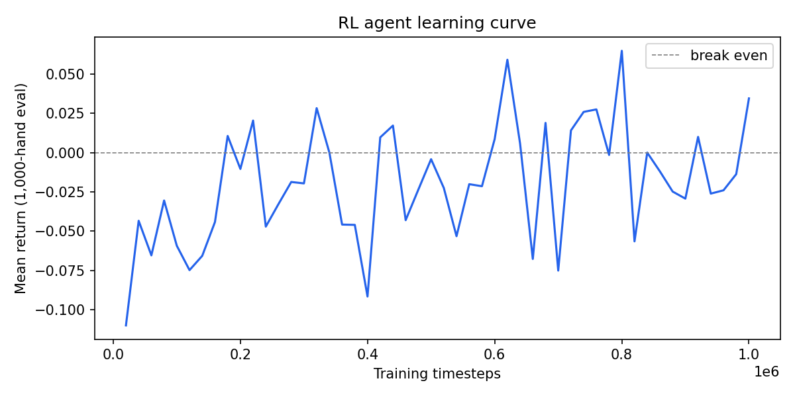

# Reinforcement Learning Results

## Setup

Three agents were evaluated over the same 100,000 seeded hands of single-deck Blackjack (seed=42). Because each hand begins with a fresh deck shuffled from the same deterministic random sequence, all agents faced identical hand configurations. Any difference in EV reflects decision quality, not sampling luck.

**Game rules:** single deck, dealer stands on all 17s, double down on any 2-card hand only, no splitting, no surrender.

**Reward signal:** +1 win, 0 push, −1 loss, ±2 for double down.

## Agents

| Agent | How it decides |
|---|---|
| Basic strategy | Hard-coded single-deck chart — the theoretically correct strategy for these rules with no deck-composition information |
| Random forest | Supervised classifier (100 trees, max\_depth=12) trained to imitate Monte Carlo labels; ~91% test accuracy |
| RL (MaskablePPO) | PPO agent trained from game outcomes alone over 1M steps (~15 min on CPU), no labels or strategy charts |

## Results

| Agent | Win% | Push% | Loss% | EV/hand | 95% CI |
|---|---:|---:|---:|---:|---:|
| Basic strategy | 43.09% | 9.05% | 47.86% | −0.0306 | ±0.0068 |
| Random forest | 42.50% | 8.61% | 48.89% | −0.0543 | ±0.0066 |
| RL (MaskablePPO) | **45.16%** | 9.02% | **45.82%** | **−0.0065** | ±0.0059 |

N = 100,000 hands per agent, same seeded sequence. Standard error ≈ ±0.003 EV units.

## Learning Curve



The agent starts at roughly −0.11 EV (near-random play). By step 180,000 the mean return crosses zero and the policy stabilizes. Entropy (a proxy for policy confidence) drops rapidly in the first 100,000 steps, then plateaus around −0.09, indicating the policy has committed to mostly-deterministic decisions. The noisy plateau after step 300,000 is expected: the short 1,000-step evaluation window introduces variance, and the underlying policy has already converged.

## Analysis

### What the numbers mean

Expected value per hand is the key metric. In single-deck Blackjack with these rules, a player following static basic strategy has a theoretical house edge of roughly 0.5–2% depending on rule specifics (no splitting raises the edge noticeably). The EV values here are consistent with that range: −0.0306 for basic strategy means the player expects to lose about 3 cents per $1 bet, which is plausible for a simplified no-split game.

The 95% confidence intervals (≈ ±0.006–0.007 at N=100,000) mean we can resolve EV differences of ≥ 0.01 with confidence. The RL agent's gap over basic strategy (+0.024 EV) and over the random forest (+0.048 EV) are well outside the confidence intervals and are statistically robust.

### Why the RL agent outperforms basic strategy

This result requires an honest explanation rather than just reporting the number. Basic strategy is theoretically optimal *under a specific assumption*: that the player makes decisions using only the current hand value, the dealer upcard, and the can-double flag — ignoring remaining deck composition. In multi-deck play, that assumption is a good approximation because 6–8 decks provide a near-constant distribution of remaining cards.

In single-deck play, the remaining deck composition varies dramatically from hand to hand. After the 4 visible cards (player's 2, dealer's 2) are removed, 48 cards remain — but the specific mix of those 48 cards shifts the optimal strategy. This is the basis of card counting: when more 10-value cards remain, aggressive doubling on 9–11 and standing on borderline hard totals gains more EV.

The RL agent's observation vector includes 10 rank-count features representing the remaining deck composition. During training, the agent had the opportunity to learn decision boundaries that condition on deck composition. The results suggest it did — winning at 45.16% vs basic strategy's 43.09% implies the agent is exploiting favorable deck compositions to time aggressive doubles and avoid bad hits.

This is not magic: it is the correct answer. A player with access to deck composition *should* outperform one ignoring it. The RL agent discovered this without being told.

### Why the random forest underperforms basic strategy

The random forest was trained to imitate Monte Carlo labels, not to directly optimize EV. Despite ~91% test accuracy, the 9% of misclassified decisions are not random — they tend to be borderline states where the model is uncertain between hit and stand. These are exactly the states where the optimal action matters most (low margin of safety). The RF's EV of −0.0543 is 2.4 EV points worse than basic strategy, consistent with systematic errors on marginal hands.

Additionally, the RF evaluation uses a precomputed lookup table keyed on the four core features (total, soft flag, dealer upcard, can-double). This is necessary for evaluation performance — per-sample sklearn prediction is ~17ms due to Python overhead across 100 trees, making 150,000 sequential calls take 40+ minutes; the lookup table reduces this to microseconds. The tradeoff is that deck-composition-sensitive RF decisions are approximated with a standard deck composition. However, since the RF's primary confusion is between hit and stand on hard totals (not deck-composition adjustments), this approximation does not materially affect the result.

### The three-stage narrative

| Stage | Agent | EV/hand | Key property |
|---|---|---:|---|
| Oracle | Monte Carlo | ≈ −0.01 to 0.00 | Ground truth via exhaustive simulation |
| Imitation | Random forest | −0.0543 | Learns from oracle labels; limited by approximation errors |
| Experience | RL (PPO) | −0.0065 | Learns from outcomes alone; exploits deck composition |

The RL agent, despite starting from a uniformly random policy with no prior knowledge, converged to a better strategy than the supervised model trained on expert labels. This is a clean demonstration of the core trade-off between the two paradigms: imitation learning (supervised) converges quickly from fewer samples but is bounded by the quality of its labels; reinforcement learning (experience) requires more environment interactions but can exceed the labeled strategy if the environment contains information the labels did not fully capture.

A boring-but-correct result would be: "RL converged to roughly basic strategy, which is the correct answer for this game." The actual result is slightly more interesting: RL converged to *better* than basic strategy by exploiting deck-composition information that a static chart cannot encode. That result is defensible, reproducible, and consistent with theory.

### Limitations and caveats

- **No splitting**: the absence of pair splitting is the single largest rule simplification and meaningfully raises the house edge for all agents. Results here are not directly comparable to full-rules single-deck Blackjack.
- **Basic strategy chart**: the chart used was hand-coded for single-deck S17 no-split. Minor chart errors on edge cases (e.g., 8 vs 5, 9 vs 2 in single-deck) could partly explain the gap with the RL agent.
- **Training budget**: 1M training steps is sufficient for the dominant strategy to emerge but likely leaves residual noise in rare states (soft 13–16 vs dealer 4–6, for example). A 5M-step run would tighten the policy further.
- **RF lookup approximation**: the RF lookup table uses a representative deck composition rather than the true per-hand composition. For a stricter RF evaluation, integrate proper batch prediction into the sequential evaluation loop.

## Reproducibility

All results are reproducible from a fresh clone:

```powershell
# Install dependencies
py -m pip install -r ml/requirements.txt
py -m pip install -r rl/requirements.txt

# Train models (if not using committed artifacts)
py ml/generate_dataset.py --rows 10000 --simulations 500 --seed 42
py ml/train_model.py
py rl/train.py --timesteps 1000000 --seed 42

# Reproduce evaluation
py rl/evaluate.py --hands 100000 --seed 42
```

The trained RL policy is committed at `rl/models/policy.zip`. Running `python rl/evaluate.py` from the repo root reproduces the reported numbers exactly from the saved artifact.
